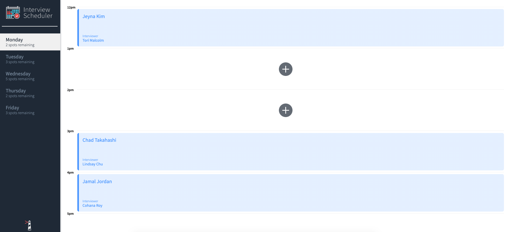
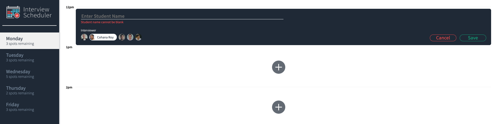
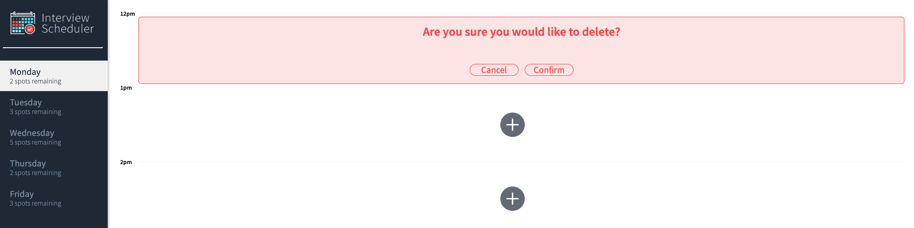

# Interview Scheduler

Using the latest tools and techniques, "Interviewer Scheduler" build and test a React application that allows users to book and cancel interviews. It combines a concise API with a WebSocket server to build a realtime experience.

## Final Product 

_Main page, appointment request_
 

_Main page, appointment added_
 

_Main page, appointment request with no name(student name can not be blank)_
 

_Main page, appointment delete(with confirm message)_
 

## Setup

Install dependencies with `npm install`.

## Running Webpack Development Server

```sh
npm start
```

## Running Jest Test Framework

```sh
npm test
```

## Running Storybook Visual Testbed

```sh
npm run storybook
```
## Dependencies
- axios
- classnames
- normalize.css
- react
- react-dom
- react-scripts